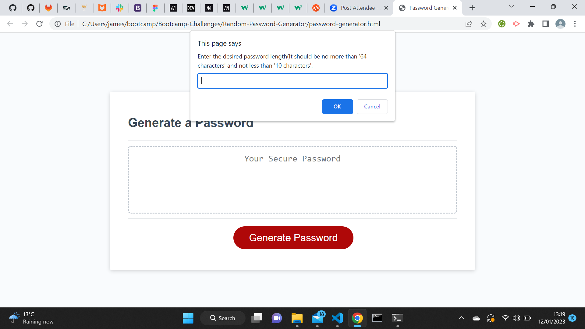

# Random-Password-Generator

## Project

This project required creating an application with which an employee could use ot generate a random password, based on criteria they've selected by modifying a starter code given to us. The application will run in the browser, and will feature dynamically updated HTML and CSS powered by Javascript code that I will write.

## Acceptance Criteria

In creating the application, there are certain criteria that had to be met to ensure that the application fulfilled it's expected behaviour. And they were:
1. To generate a password when the button is clicked.
2. Present a series of prompts for password criteria. These password criterias are:
   - Enter the desired password length(It should be no more than '64 characters' and not less than '10 characters'.
   - Do you want to include lower case characters?
   - Do you want to include upper case characters?
   - Do you want to include numeric characters?
   - Do you want to include special characters?
3. The code should validate for each input and at least one character type should be selected.
4. Once prompts are answered then the password should be generated and displayed in an alert or written to the page.

## Outcome

This challenge was certainly challenging, however I was able to acheive the desired outcome.
1. I was able to write code that will prompt the user to type in how long they wanted their generated password to be, and if they choose any number outside of the parameters given there would be an alert to remind them that the password should be no more than 64 character and no less than 10 characters.

   

   

   

2. I wrote code that was able to prompt users as to if they wanted to include either numeric, lowercase, uppercase and/or special characters in their generated password. They have to pick atleast one of the options presented to them.

   

   

   

   

   

3. The code was able to validate each input, including how long they want their password to be.

4. Lastly, once all prompts are answered the password is then generated to the page.

   

   

## License

MIT License

Copyright (c) 2022 JayClay922

Permission is hereby granted, free of charge, to any person obtaining a copy
of this software and associated documentation files (the "Software"), to deal
in the Software without restriction, including without limitation the rights
to use, copy, modify, merge, publish, distribute, sublicense, and/or sell
copies of the Software, and to permit persons to whom the Software is
furnished to do so, subject to the following conditions:

The above copyright notice and this permission notice shall be included in all
copies or substantial portions of the Software.

THE SOFTWARE IS PROVIDED "AS IS", WITHOUT WARRANTY OF ANY KIND, EXPRESS OR
IMPLIED, INCLUDING BUT NOT LIMITED TO THE WARRANTIES OF MERCHANTABILITY,
FITNESS FOR A PARTICULAR PURPOSE AND NONINFRINGEMENT. IN NO EVENT SHALL THE
AUTHORS OR COPYRIGHT HOLDERS BE LIABLE FOR ANY CLAIM, DAMAGES OR OTHER
LIABILITY, WHETHER IN AN ACTION OF CONTRACT, TORT OR OTHERWISE, ARISING FROM,
OUT OF OR IN CONNECTION WITH THE SOFTWARE OR THE USE OR OTHER DEALINGS IN THE
SOFTWARE.

## Deployed Web Application

The URL of the deployed application is:
